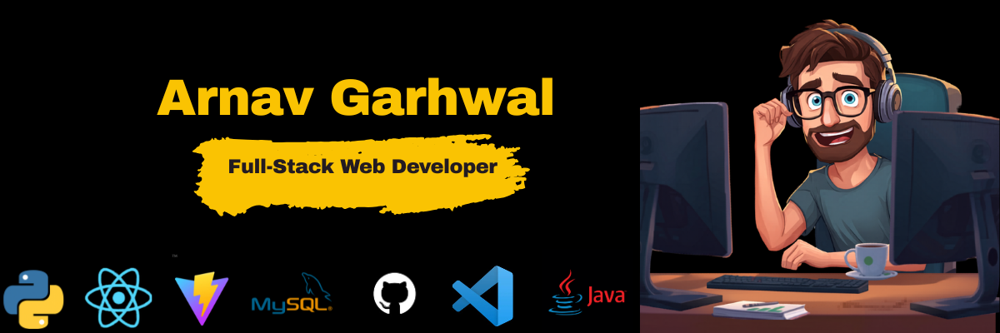

👋**Hey there, I'm Arnav Garhwal**  🚀

-----
## 🧠 About Me

<samp>
  <h3>⚡ Engineering the Future with Code & Intelligence</h3>
</samp>

I am a passionate **Full-Stack Web Developer** and **AI Enthusiast** focused on architecting immersive web experiences, robust backends, and intelligent software applications. I thrive on building products that merge clean, minimalist user interfaces with complex underlying logic. 

### 🌐 Technical Focus Areas
* **Full-Stack Engineering:** Architecture and deployment of responsive, high-performance web applications using modern javascript ecosystems.
* **Artificial Intelligence:** Designing predictive systems and machine learning integrations to solve real-world sector challenges.
* **UI/UX Design:** Crafting elegant, highly intuitive user interfaces that balance engineering functionality with exceptional digital experiences.

---

### 💻 Key Projects

* **Diagnostic Whisperer:** Co-founded and engineered an advanced diagnostic software solution focused on intelligent analysis.
* **Intelifarmsystem:** Developed a comprehensive agricultural web application integrated with Machine Learning price prediction models.
* **Bloom:** Conceptualized and built a smart personal finance and funds management application.
* **Recipe Generator:** Engineered an interactive recipe application powered by Java and external API integrations.

---

> 💡 **Core Philosophy:** *Learning by building. I believe in translating complex technical theories into production-ready, open-source code that impacts real-world workflows.*

 

  

-----

## ⚡ Tech Stack

### 💻 Languages

---

### 🌐 Frontend Development

* React.js
* Responsive UI Design
* Modern Web Interfaces

---

### ⚙️ Backend Development

* Node.js
* Express.js
* REST APIs
* Backend Architecture

---

### 🗄️ Databases & Cloud

* PostgreSQL
* Git & GitHub

---
## 💼 Professional Experience

### 🚀 Project Intern — Consisty System
**June 2025 – July 2025** | Remote / Hybrid
* **Full-Stack Collaboration:** Partnered with core engineering teams to design and deploy software features utilizing **Java, Python, Node.js, and React**.
* **Performance Engineering:** Improved total application efficiency and responsiveness through codebase optimization and deep-dive debugging workflows.
* **UI/UX Refinement:** Designed user-centric, modern responsive web interfaces to optimize digital product accessibility and end-user engagement.
* **Agile Planning:** Devised internal project roadmaps and milestone timelines to consistently secure prompt task delivery.

---

### 🤝 Leadership & Volunteering
* **NSS Volunteer (2024 - Present):** Orchestrated event coordination, planning frameworks, and facility management workflows using robust interpersonal communication skills.
* **Job Fair HR Assistant:** Volunteered within the core HR team, mastering large-scale logistics, professional interaction dynamics, and high-impact event management operations.

 

-----

## 🏆 Achievements & Extra-Curricular Track

### 🥋 Martial Arts & Athletics
* **Karate Black Belt (Dan 1):** Elite-level practitioner. 
* **International Champion:** 2-Time International Gold Medalist.
* **National Dominance:** 4-Time National Level Gold Medalist.
* **Kreedangan:** Active competitor in the 2024 College Sports Meet.
* *Hobbies:* Mixed Martial Arts (MMA), Basketball, and Swimming.

---

### 🗣️ Leadership & Academics
* **Student Council:** Elected Department Junior Secretary for Computer Science & Design (CSD).
* **School Captain:** Served as School Captain (Class 12) and Vice Sports Captain (Class 11).
* **Achievers Gala:** Won **1st Prize** in the formal Debate Competition.

 

  

-----

## 🎓 Education

| Institution | Degree | Timeline |
| :--- | :--- | :--- |
| **Mumbai University** | B.Tech in Computer Science & Design | 2024 - 2028 |
| **Kendriya Vidyalaya** | Higher Secondary Certificate (Class XII) | 2022 - 2024 |
| **Kendriya Vidyalaya** | Secondary School Certificate (Class X) | 2021 - 2022 |

 

---

## 📊 GitHub Stats

  
  
  

  

